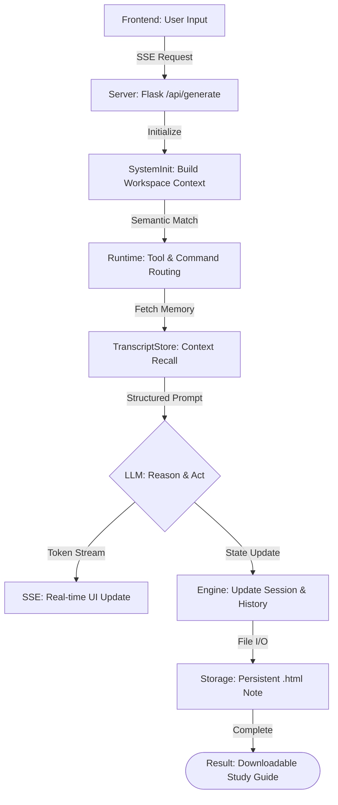
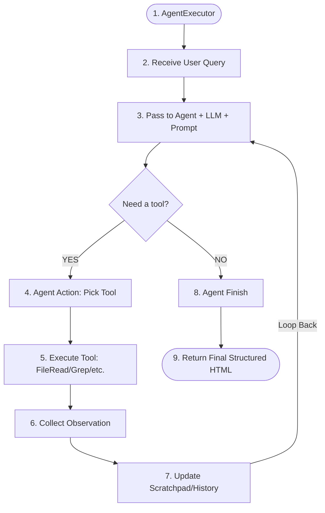

<p align="center">
  
  
  
  
  
</p>

---

## Quick Start

```bash
# Clone from Hugging Face Space
git clone https://huggingface.co/spaces/ashyou09/Notes_weiver

# Or clone from GitHub
git clone https://github.com/ashyou09/Note_weiver.git
```

---

## What is NotesMaster AI?

**NotesMaster AI** is a privacy-first study notes generator that turns any topic, pasted text, or uploaded PDF into beautifully structured HTML study notes.

**Two AI backends supported — automatically detected:**

- 🖥️ **Local** — Qwen3.5 (any size) via Ollama running on your machine
- ☁️ **Cloud** — Qwen3-8B (latest) via Hugging Face Inference API (set `HF_TOKEN`)

> **No data leaves your machine in local mode.** Cloud mode sends content to HF Inference API.

---

## Features

| Feature                    | Details                                                                               |
| -------------------------- | ------------------------------------------------------------------------------------- |
| 📝**Topic Mode**     | Type any subject — AI generates complete structured notes from scratch               |
| 📋**Paste Mode**     | Paste lecture notes, articles, transcripts — AI organizes them into a study guide    |
| 📁**Upload Mode**    | Drop a PDF, TXT, or MD file — AI extracts and structures the content                 |
| ⚡**Live Streaming** | Watch AI write notes token-by-token in real time                                      |
| 🖥**Preview Panel**  | Rendered HTML preview, raw HTML view, one-click download                              |
| 🆕**Qwen3-8B Cloud** | Latest Qwen3 model via HF Inference API — no Ollama required                         |
| 🗑**Delete Notes**   | Remove individual notes or clear all saved notes with one click                       |
| 💾**Session Memory** | Context persists across requests via claw's `QueryEnginePort` + `TranscriptStore` |
| 🔄**History Panel**  | All generated notes saved locally; reload any previous note instantly                 |
| 🤖**Model Selector** | Switch between Qwen3.5 size variants or Qwen3-8B cloud per-request                    |

---

## Architecture

NotesMaster AI follows a decoupled architecture, separating the presentation layer from the intelligent orchestration layer.

```
┌─────────────────────────────────────────────────────────┐
│                  NotesMaster AI                         │
│                                                         │
│   notesmaster/static/index.html  ──── Dark glassmorphism│
│          │  (Flask SSE streaming UI)                    │
│          ▼                                              │
│   notesmaster/server.py          ──── Flask backend     │
│          │                                              │
│          ├──► src/query_engine.py   (session routing)   │
│          ├──► src/transcript.py     (history compaction) │
│          ├──► src/session_store.py  (JSON persistence)  │
│          ├──► src/history.py        (event timeline)    │
│          ├──► src/runtime.py        (prompt routing)    │
│          └──► src/system_init.py    (workspace context) │
│                                                         │
│   ┌──────────────────────────────────────────────────┐  │
│   │  AI Backend (auto-detected)                      │  │
│   │  1. Local Ollama → Qwen3.5:4b (default)          │  │
│   │  2. HF Inference API → Qwen3-8B (HF_TOKEN)       │  │
│   └──────────────────────────────────────────────────┘  │
└─────────────────────────────────────────────────────────┘
```

### 1. Presentation Layer (Frontend)
- **Technology**: Vanilla HTML5, CSS3 (Glassmorphism), and asynchronous JavaScript.
- **Communication**: Uses **Server-Sent Events (SSE)** to stream AI responses token-by-token, providing a responsive, "live-writing" experience.
- **Features**: Real-time rendering, model switching, and session management.

### 2. Orchestration Layer (Backend)
- **Technology**: Flask (Python 3.11+).
- **Responsibility**: Routes user requests, manages file uploads (PDF/TXT), and interfaces with the Claw Agent Infrastructure.

### 3. Intelligence Layer (AI Models)
- **Local Integration**: Interfaces with **Ollama** using OpenAI-compatible endpoints.
- **Cloud Integration**: Interfaces with **OpenRouter/HF Inference API** for high-performance models when local hardware is limited.

---

## Agent Infrastructure (Claw-Code)

The "Agentic" behavior of NotesMaster AI is powered by the **Claw-Code Infrastructure** located in the `src/` directory. Rather than being a simple chatbot, the system uses several coordinated components to maintain state and context.

### 💡 Key Components

| Component | Responsibility |
| :--- | :--- |
| **`QueryEnginePort`** | The central orchestrator for a "turn." It manages session IDs, tracks token usage, and ensures the LLM stays within its "thought budget." |
| **`TranscriptStore`** | Acts as the agent's short-term and long-term memory. It captures all user prompts and AI responses, performing **auto-compaction** to keep the context window efficient. |
| **`PortRuntime`** | Handles prompt routing and multi-step logic. It ensures that the system knows which "tools" or "skills" are available in the current workspace context. |
| **`SystemInit`** | Dynamically builds the "Workspace Context" injected into every prompt, giving the AI awareness of the repository structure and environment. |

### 🧠 How the "Agent" Works
1.  **Context Injection**: Every request starts by building a workspace map via `build_system_init_message()`.
2.  **Memory Recall**: The `TranscriptStore` replays previous turns, ensuring the AI remembers what was discussed or generated earlier in the session.
3.  **State Persistence**: Sessions are saved as JSON in `notesmaster/.sessions/`, allowing users to resume their work even after a server restart.
4.  **Token Management**: The `QueryEnginePort` monitors budget to prevent infinite loops or excessive costs, automatically compacting history when it gets too long.

---

## How the Agent Thinks: The ReAct Loop

NotesMaster AI follows a **ReAct (Reason + Act)** pattern to ensure that the study notes it generates are deep, structured, and technically accurate.

### 🧠 The Reasoning Process

| Step | Name | Component | Internal Logic |
| :--- | :--- | :--- | :--- |
| **1** | **Thought** | `LLM Core` | Analyzes user input to determine the pedagogical path (e.g., "Define first, then provide Python code"). |
| **2** | **Action** | `PortRuntime` | Performs semantic matching to identify if local workspace context or specific tools are needed. |
| **3** | **Action Input** | `SystemInit` | Synthesizes the exact instruction set, applying strict CSS/HTML formatting rules from `SYSTEM_BASE`. |
| **4** | **Observation** | `TranscriptStore` | Recalls history to avoid repetition and maintain context across a multi-turn study session. |
| **...** | **...** | `Loop` | The cycle continues if the model needs more tokens to fulfill complex technical sections. |
| **Final** | **Final Answer** | `server.py` | Finalizes the self-contained HTML document, saves it to `/notes`, and renders it in the UI. |

### 🛠 Visual Request Lifecycle



### 📋 Lifecycle of a Request (Step-by-Step)
1. **Trigger**: You press "Generate Notes" in the browser.
2. **Analysis**: The backend (`server.py`) identifies if you are in **Topic**, **Paste**, or **Upload** mode.
3. **Context Construction**: The `SystemInit` module scans your workspace to give the AI context about the project environment.
4. **Memory Retrieval**: The `TranscriptStore` pulls the last 10 messages from your session to ensure continuity.
5. **Intelligent Routing**: `PortRuntime` scores your request against available mirrored tools (like `FileReadTool`) to decide what "skills" to use.
6. **Streaming Generation**: The selected LLM (Qwen or Llama) streams valid HTML tokens via **Server-Sent Events (SSE)**.
7. **Persistence**: Once generation is finished, the backend saves the full HTML string as a unique file in the `notes/` directory.
8. **Completion**: The UI receives a `done` event, providing the final file link for download or preview.

---

---

## LLM Reason & Act: The Core Loop

NotesMaster AI utilizes a sophisticated **AgentExecutor** loop that allows the LLM to reason dynamically and interact with its environment through tools. This ensures that every note generated is contextually relevant and technically accurate.

### 🛠 The Reasoning Loop (Process Map)



### 🧠 How it Works

1.  **Orchestration**: The `AgentExecutor` (managed by `QueryEnginePort`) initiates the session.
2.  **Prompt Engineering**: The user's query is wrapped in a high-density system prompt and passed to the logic engine.
3.  **The Decision Point**: The LLM evaluates if it has enough information to generate the notes. If it needs to "know" more about your workspace or a specific file, it triggers the tool-use branch.
4.  **Action & Execution**: `PortRuntime` semantically selects the appropriate tool (e.g., `FileReadTool` for a PDF or `GrepTool` for workspace search).
5.  **Observation**: The output from the tool is fed back into the `TranscriptStore`.
6.  **Refinement**: The "Scratchpad" (our rolling context) is updated with this new information, and the loop repeats until the LLM is confident.
7.  **Finalization**: Once the LLM decides no more tools are needed, it synthesizes the final HTML study guide.

---

## Agentic Tool Surface

To extend the capabilities of the core LLM, NotesMaster AI uses a **Mirrored Tool Surface** provided by the Claw infrastructure. These tools allow the agent to interact with the environment and manage complex data structures during the "Act" phase.

### 🛠 Active Tools

| Tool | Category | Role in NotesMaster |
| :--- | :--- | :--- |
| **`FileReadTool`** | Workspace | Reads uploaded PDFs and text files to extract source material for notes. |
| **`GrepTool`** | Discovery | Searches the local session history and workspace for related topics to ensure consistency. |
| **`BashTool`** | System | (Gated) Used for environment verification and local resource management. |
| **`TranscriptStore`** | Memory | An internal tool that manages the rolling conversation history and auto-compaction. |
| **`SystemInit`** | Context | Injects current repository structure and environment variables into the agent's context. |
| **`PortRuntime`** | Routing | Dynamically scores and matches user prompts to the most relevant tools/commands. |

### 🔄 Dynamic Tool Matching
During every generation request, the `PortRuntime.route_prompt()` method performs semantic matching between your query and these tools. If a match is found with a high enough score, the tool's context is prioritized for the AI's reasoning process.

---

## Repository Layout

```
notes_weiver/
├── notesmaster/
│   ├── server.py          # Flask backend — routes, SSE streaming, dual-backend AI
│   ├── requirements.txt   # flask, requests, pypdf
│   ├── static/
│   │   └── index.html     # Dark glassmorphism UI — no framework needed
│   ├── notes/             # Generated HTML notes saved here
│   ├── uploads/           # Temp storage for uploaded files
│   └── .sessions/         # claw JSON session files
│
├── src/                   # claw-code Python harness (the infrastructure layer)
│   ├── query_engine.py    # QueryEnginePort — session + turn management
│   ├── transcript.py      # TranscriptStore — rolling context history
│   ├── session_store.py   # JSON session persistence
│   ├── history.py         # HistoryLog — per-request event log
│   ├── runtime.py         # PortRuntime — prompt routing + tool matching
│   ├── system_init.py     # Workspace context builder
│   └── ...                # Full harness: plugins, skills, coordinator, etc.
│
├── rust/                  # Rust port of the claw-code CLI (standalone runtime)
├── tests/                 # Python harness verification tests
├── Dockerfile             # HF Spaces deployment (python:3.11-slim, port 7860)
└── README.md              # This file
```

---

## Quickstart — Local

### Prerequisites

- **Python 3.11+**
- **[Ollama](https://ollama.com/)** installed and running locally
- Qwen3.5 model pulled:

```bash
ollama pull qwen3.5:4b
```

### Run

```bash
# Clone
git clone https://github.com/ashyou09/Note_weiver.git
cd Note_weiver

# Install deps
pip install -r notesmaster/requirements.txt

# Start Ollama
ollama serve

# Launch NotesMaster
python notesmaster/server.py
```

Open **http://localhost:7860** in your browser.

---

## Quickstart — Hugging Face Space (Cloud)

```bash
git clone https://huggingface.co/spaces/ashyou09/Notes_weiver
cd Notes_weiver
```

The Space uses **Docker SDK** and runs on port `7860`. Set these secrets in your Space settings:

| Secret          | Value                       | Required                       |
| --------------- | --------------------------- | ------------------------------ |
| `HF_TOKEN`    | Your HF token (read access) | ✅ For Qwen3 cloud             |
| `HF_MODEL`    | `Qwen/Qwen3-8B`           | Optional (this is the default) |
| `NOTES_MODEL` | `Qwen/Qwen3-8B`           | Optional override              |

Then the **Qwen3-8B ☁️** option in the model selector will stream from HF Inference API automatically.

---

## Usage

### Mode 1 — Topic Mode

Type any subject and click **Generate Notes** (or press `Ctrl+Enter`):

```
Examples:
  • Python Decorators and Closures
  • How does TCP/IP work internally?
  • Gradient Descent — intuition to math
  • Transformer Attention Mechanism
  • SOLID Principles in OOP
```

### Mode 2 — Paste Mode

Switch to **Paste Content**, paste raw text (lecture notes, articles, transcripts), generate.

### Mode 3 — Upload Mode

Switch to **Upload PDF / File**, drop a `.pdf`, `.txt`, or `.md` file, generate.

### Deleting Notes

- **Single note**: hover over any note in the Recent Notes panel → click the 🗑 trash icon
- **All notes**: click the **🗑 Clear All** button in the Recent Notes header

---

## Model Options

| Model            | Type          | Speed       | Best For                         |
| ---------------- | ------------- | ----------- | -------------------------------- |
| `qwen3.5:2b`   | Local         | ⚡⚡        | **Default — recommended** |
| `qwen3.5:4b`   | Local         | ⚡ Balanced | Balanced reasoning / depth       |
| `llama3.2:3b`  | Local         | ⚡⚡        | Great alternative for technical topics |
| `Qwen3-8B`     | ☁️ HF Cloud | ⚡          | Latest Qwen3, no Ollama needed   |
| `Qwen2.5-7B`   | ☁️ HF Cloud | ⚡          | Stable fallback cloud model      |

---

## API Reference

| Endpoint                  | Method     | Description                               |
| ------------------------- | ---------- | ----------------------------------------- |
| `/api/status`           | `GET`    | Backend status (ollama / hf / none)       |
| `/api/generate`         | `POST`   | SSE stream — generate notes              |
| `/api/upload`           | `POST`   | Upload PDF/TXT/MD, returns extracted text |
| `/api/notes`            | `GET`    | List all saved notes                      |
| `/api/notes`            | `DELETE` | Delete all saved notes                    |
| `/api/notes/<filename>` | `GET`    | Get a specific note                       |
| `/api/notes/<filename>` | `DELETE` | Delete a specific note                    |
| `/api/sessions`         | `GET`    | List claw session files                   |

---

## Environment Variables

| Variable            | Default                       | Description                              |
| ------------------- | ----------------------------- | ---------------------------------------- |
| `PORT`            | `7860`                      | Server port (7860 for HF Spaces)         |
| `OPENAI_BASE_URL` | `http://127.0.0.1:11434/v1` | Local Ollama endpoint                    |
| `OPENAI_API_KEY`  | `ollama`                    | API key (any string for local Ollama)    |
| `HF_TOKEN`        | _(empty)_                   | HF token for Qwen3 cloud inference       |
| `HF_MODEL`        | `Qwen/Qwen3-8B`             | HF model to use when `HF_TOKEN` is set |
| `NOTES_MODEL`     | `qwen3.5:4b`                | Default model shown in UI                |

---

## Tech Stack

- **Frontend**: Pure HTML/CSS/JS — dark glassmorphism, animated, no framework
- **Backend**: Flask 3.x with SSE streaming
- **Local AI**: Ollama (Qwen3.5 family) via OpenAI-compat `/v1/chat/completions`
- **Cloud AI**: HF Inference API (Qwen3-8B) via OpenAI-compat endpoint
- **Infrastructure**: claw-code Python harness (`src/`) — session, routing, transcript
- **PDF Extraction**: `pypdf`
- **Deployment**: Docker on Hugging Face Spaces (port 7860)

---

## Deploy / Sync Workflow

```bash
# Push updates to GitHub
git add .
git commit -m "feat: your change"
git push origin main

# Push to Hugging Face Space
git push hf main
```

Remotes:

```bash
git remote add origin https://github.com/ashyou09/Note_weiver.git
git remote add hf     https://huggingface.co/spaces/ashyou09/Notes_weiver
```

---

## Note Output Format

Every generated note is a **self-contained HTML file** with:

- Google Fonts (Crimson Pro, Source Sans 3, JetBrains Mono)
- Deep navy color scheme with light-blue tinted code/formula boxes
- Orange/green/red left-border highlight cards
- Two-column comparison grids and step flow diagrams
- Syntax-highlighted code blocks
- Key Takeaways section (8–12 points)

Notes are saved to `notesmaster/notes/` as `{topic}_{YYYYMMDD_HHMMSS}.html`.
